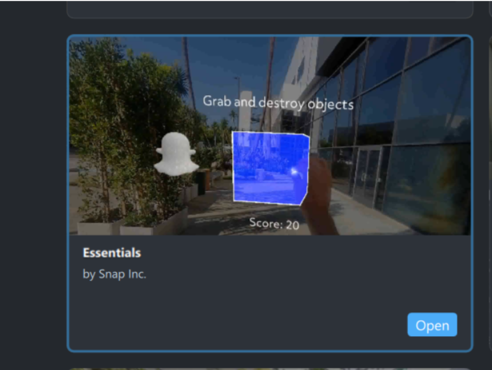
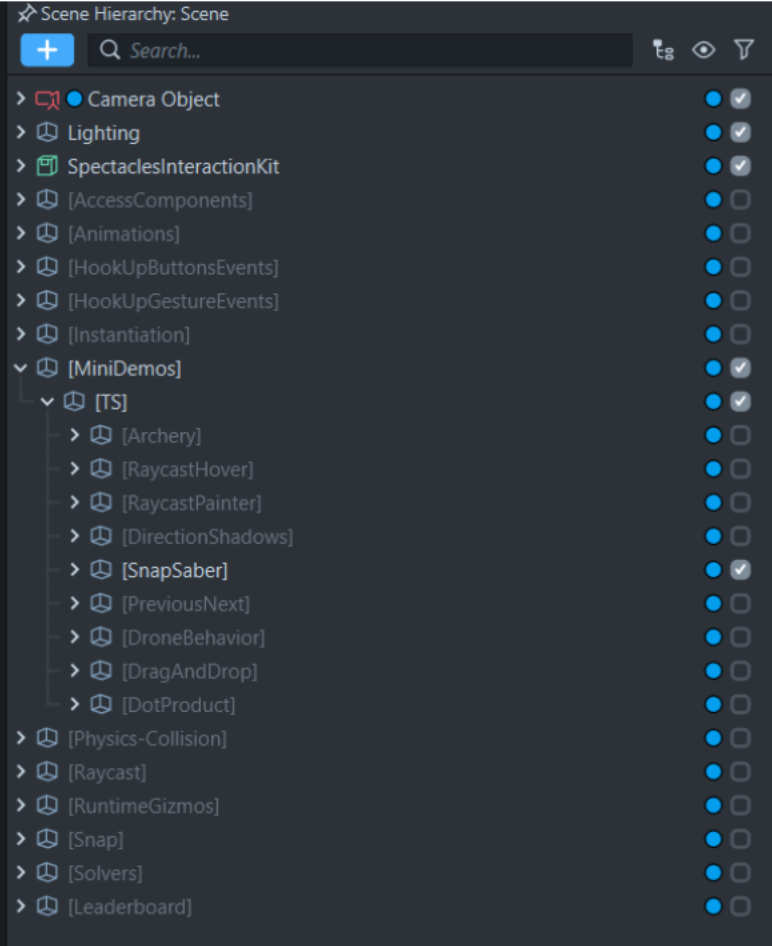
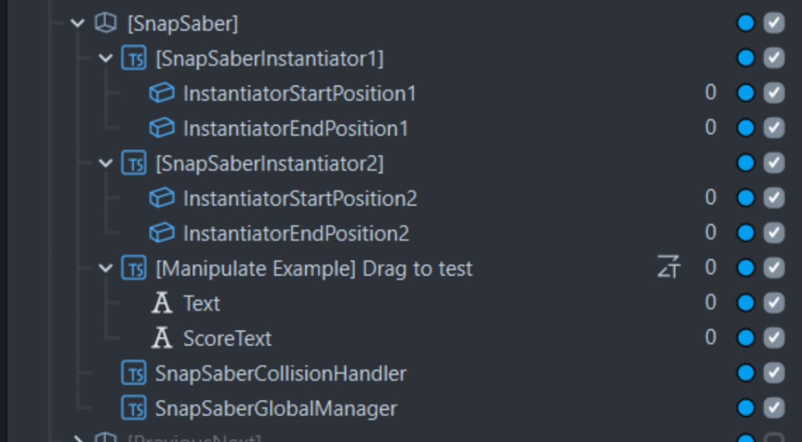
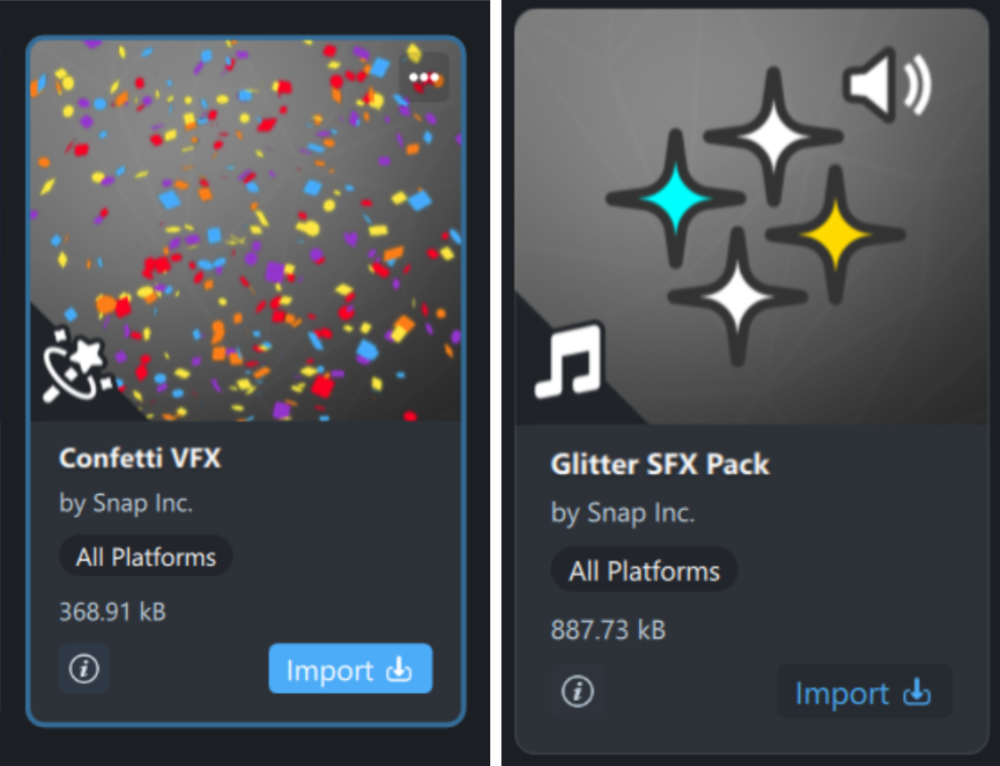
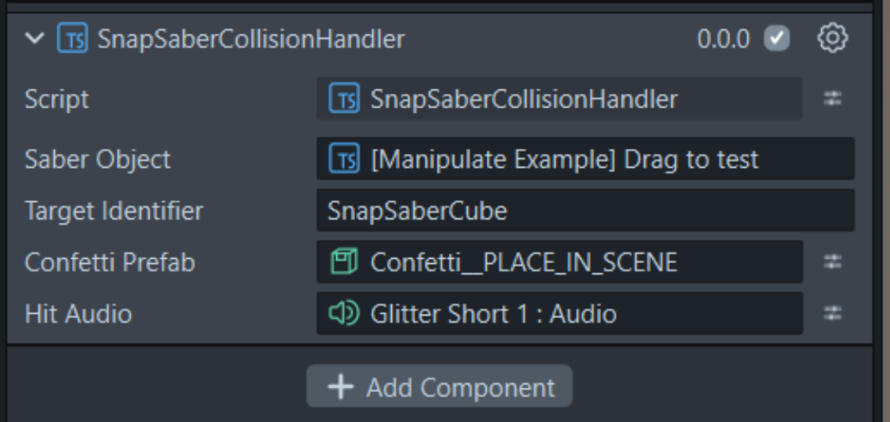

# VFX + Sound | Essentials Project Sprint

## Setup

- Find the **Essentials Sample Project** and open it.
- Save it as **`Essentials VFX and Sound Workshop`** (or a name you'll remember).

 - In the **Scene Hierarchy**, make `MiniDemos`, `[TS]`, and `[SnapSaber]` visible.
   - You should now be able to move a cube around to destroy the ghosts.

## Walkthrough of Scene

| Scene Object | Description |
|---|---|
| **`[SnapSaber]`** | Parent SceneObject used to group all scene items. Contains no components or scripts. |
| **`[SnapSaberInstantiator1]`** / **`[SnapSaberInstantiator2]`** | Ghost spawners: all logic lives in the `SnapSaberInstantiator` script. `InstantiatorStartPosition` and `InstantiatorEndPosition` are meshes marking where ghosts spawn and despawn. Try tweaking their transform values! |
| **`[Manipulate Example]`** | The draggable blue box used to destroy ghosts. Contains interactability logic, visual effects (white outline), and holds `Text` + `ScoreText` (instructions and score counter). |
| **`SnapSaberCollisionHandler`** | Handles collision detection between the blue cube and ghost targets. Sends hit data to `SnapSaberGlobalManager` to update the score. |
| **`SnapSaberGlobalManager`** | Central access point for shared features: updating the text component, tracking the score, and more. |

## VFX + Sound Effects

### Import Assets

In the **Asset Library**, import:
- `Confetti VFX`
- `Glitter SFX Pack`

> These will automatically appear in your Scene Hierarchy. you can uncheck them to hide them.

### Assign Assets

Open `SnapSaberCollisionHandler` in the Inspector and assign:
- The **Confetti** prefab
- One of the **short Glitter SFX** clips

> And you're done! You should hear a glitter sound effect, and see a confetti visual pop up when you hit the ghosts!
